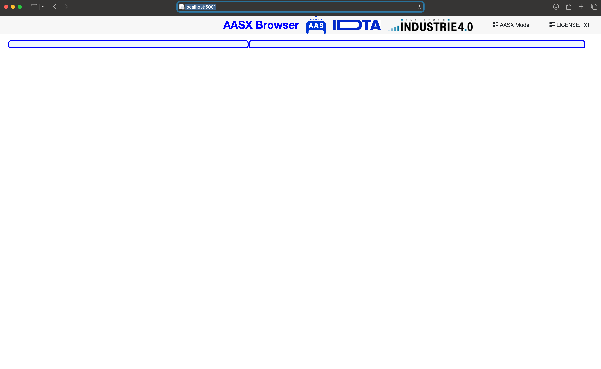
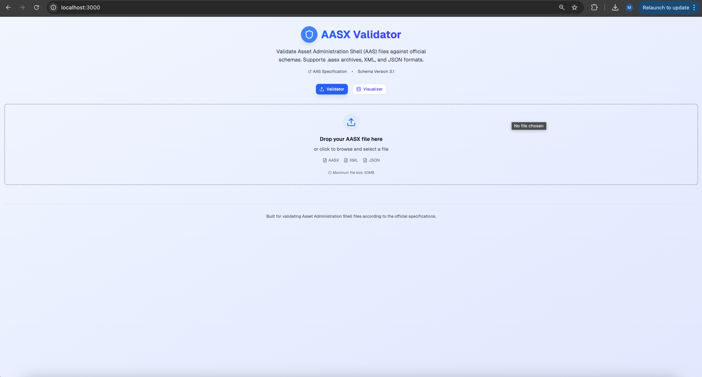
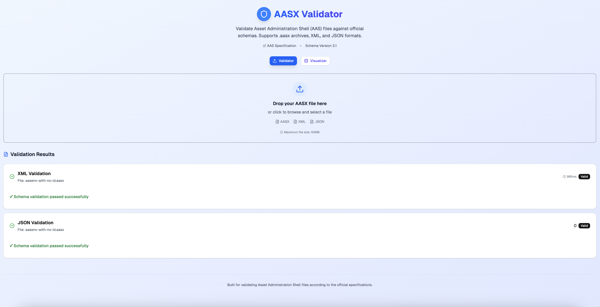
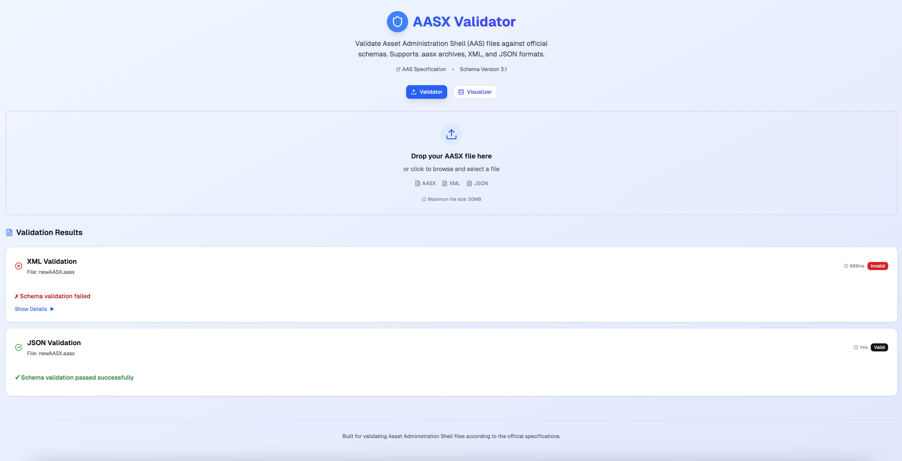
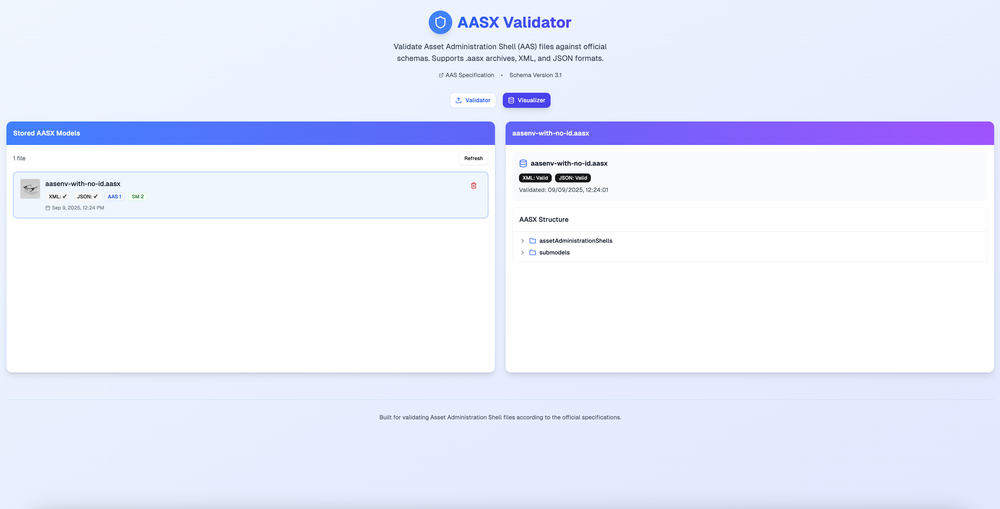
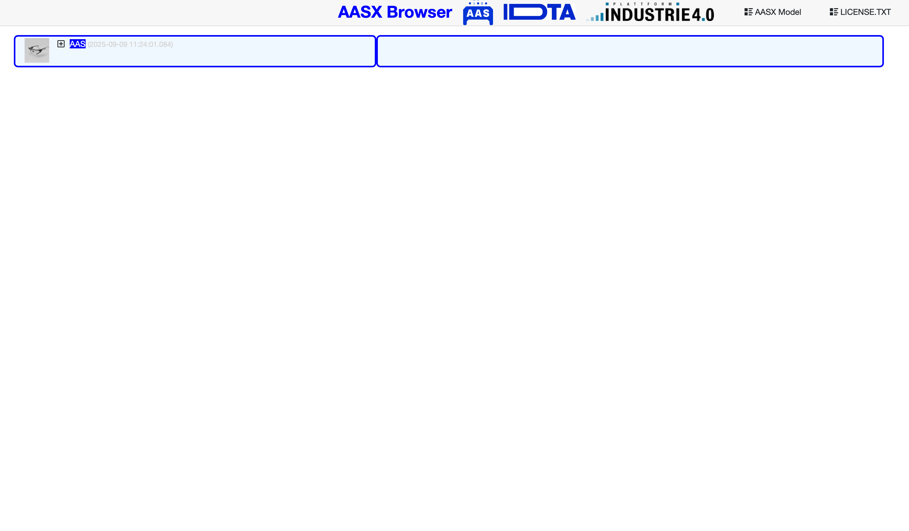

# AASX Validator

The AASX Validator is a web application designed to validate `.aasx` files (Asset Administration Shell) against official schemas. It unpacks the files to extract XML and JSON models, validates them against the Industrie 4.0 specifications, and, if both are valid, adds the model to a local browser database and an API server container. The application features a **"Visualizer"** tab with an expandable tree view of validated models, and deleting a model from the interface triggers its removal via the API server.

## Prerequisites

Before running this application, ensure the following are set up:

- **Docker**: Required to run the application and AASX server containers.
- **AASX Server Container**: The API server from the `eclipse-aaspe/server` repository must be running locally. Follow the instructions below to set it up.

## Setting Up the AASX Server

Clone the server repository:

   git clone https://github.com/eclipse-aaspe/server.git
   cd server
Use a public Docker image available on Docker Hub:

Recommended image: adminshellio/aasx-server-blazor-for-demo:latest.

Run the container with the following command:

docker run -d -p 5001:5001 --restart unless-stopped -v ./aasxs:/AasxServerBlazor/aasxs adminshellio/aasx-server-blazor-for-demo:latest
Ensure the ./aasxs directory exists locally to store AASX files.

Check if the server is running at http://localhost:5001.

## Installation and Running
Clone the Repository:
git clone https://github.com/MiguelReisRepo/aasx-validator-with-api.git
cd aasx-validator-with-api
Set Up Docker Compose
Edit the included docker-compose.yml file and ensure the NEXT_PUBLIC_AASX_API_URL environment variable points to your AASX server (e.g., http://aasx-server:5001).

## Start the services:
docker compose up -d
Access the Application
Open your browser at http://localhost:3000.

The application will be available under the "Validator" tab (for file validation) and "Visualizer" tab (to view stored models).

## How It Works
Validation: Drag and drop a .aasx file into the "Validator" tab. The application unpacks it, extracts the XML and JSON models, and validates them against official schemas from admin-shell-io/schema-validation.

Storage: If both models pass validation, the file is added to the local browser database and sent to the running AASX server.

If any of models don't pass validation, you can clearly see what's not valid and the file is not added to the local browser database or running AASX server.

Visualization: Use the "Visualizer" tab to view an expandable tree structure of validated models.

Deletion: Removing a model from the interface triggers a deletion request to the AASX server via its API.

## Dependencies
Validation: Relies on schemas from admin-shell-io/schema-validation.

Storage: Utilizes the API server from eclipse-aaspe/server for storage and synchronization.

## Contributing
Feel free to open issues or pull requests on GitHub for enhancements or bug reports.
